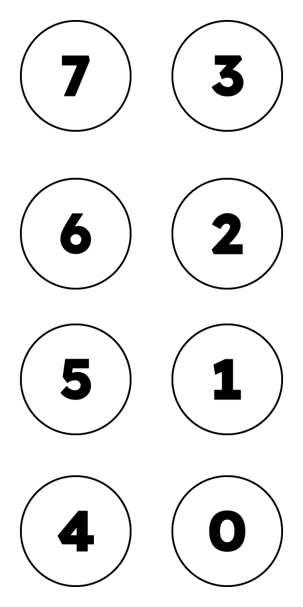
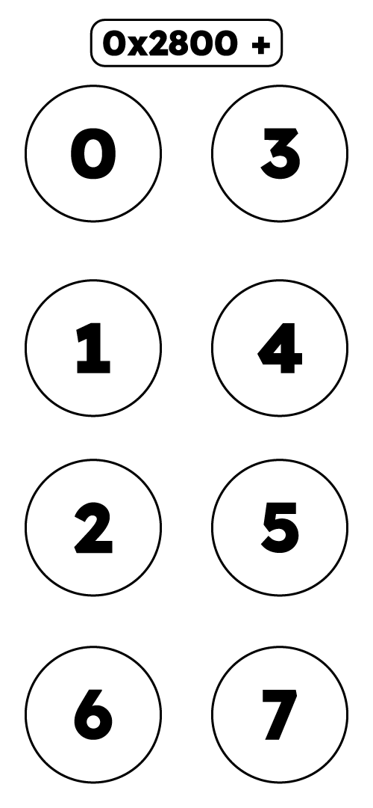

# Binary Cuneiform
A method for engraving binary data as linear impressions on a surface.

## Inspiration
Cuneiform is one of the earliest recorded methods of human writing. It is composed of characters that are made by impressing a wedge-shaped reed stylus into a clay tablet, building the characters from individual wedge marks. Even though it came into existence over 2,000 years ago, many cuneiform tablets are still legible to this very day. Similarly, of the great works built by ancient civilizations like ancient Egypt, only carved stone and shaped clay have survived the test of time, even once exposed to the elements or reused as building material, such as The Rosetta Stone.

The current best method of preserving data for future generations is to store the data as 2D barcodes on specially engineered optical film which can last 500 to 1,000 years. However, history has proven that a minimum of 1,000 years is required to ensure information survival, and in the worst case scenarios, it may be closer to 10,000+ years before a suitably advanced society re-emerges following a global near-extinction event or other major planet-wide catastrophe. If we wish to reliably preserve information for future knowledge seekers, we need something that lasts longer than 1,000 years. We need something that is both writable and readable by a human without technological aid. We need to return to the earliest forms of writing, and return to clay and stone.

To do this, we must find a way to efficiently, reliably, and logically encode binary data as impressions on a surface, ideally linear marks of equal length for ease of writing. The system proposed here is a first attempt at creating such a system. Because it is directly inspired by the way cuneiform was written, and because it represents arbitrary binary data, I have decided to name this system "Binary Cuneiform".

## Description
Individual bytes are encoded into distinct characters. Each of these 256 characters shall be composed of the following:
- 2 columns of 4 "bit strokes"
  - The bits are read top-to-bottom, left-to-right
  - An upper-left to lower-right diagonal stroke (`╲`) shall represent a 0 bit
  - A lower-left to upper-right diagonal stroke (`╱`) shall represent a 1 bit
- 1 vertical separator (`│`), no less than 1 stroke but no more than 4 strokes tall, centered right of the bit strokes
- 1 horizontal separator (`─`), no less than 1 stroke but no more than 2 strokes wide, centered underneath the bit strokes
- Upper left is MSB and lower right is LSB

<p align="center"></p>

For example, the byte 0b01100101 could be written as follows:
```
╲ ╲
╱ ╱ │
╱ ╲ │
╲ ╱
 ─
```

Multiple bytes are read in rows from left-to-right, top-to-bottom.

## Unicode Alternative: BrailleByte
According to [The Unicode Standard](https://www.unicode.org/charts/PDF/U2800.pdf), every 8-dot braille character can be made by taking the starting code point of `0x2800` and adding an 8-bit value who's bits corresponds to the dots as follows:
```
0 3
1 4
2 5
6 7
```

<p align="center"></p>

Here is a table that will allow you to convert between hexadecimal and BrailleByte.

|  | 0x00 | 0x01 | 0x02 | 0x03 | 0x04 | 0x05 | 0x06 | 0x07 | 0x08 | 0x09 | 0x0A | 0x0B | 0x0C | 0x0D | 0x0E | 0x0F |
| :---: | :---: | :---: | :---: | :---: | :---: | :---: | :---: | :---: | :---: | :---: | :---: | :---: | :---: | :---: | :---: | :---: |
| **0x00** | ⠀ | ⢀ | ⠠ | ⢠ | ⠐ | ⢐ | ⠰ | ⢰ | ⠈ | ⢈ | ⠨ | ⢨ | ⠘ | ⢘ | ⠸ | ⢸ |
| **0x10** | ⡀ | ⣀ | ⡠ | ⣠ | ⡐ | ⣐ | ⡰ | ⣰ | ⡈ | ⣈ | ⡨ | ⣨ | ⡘ | ⣘ | ⡸ | ⣸ |
| **0x20** | ⠄ | ⢄ | ⠤ | ⢤ | ⠔ | ⢔ | ⠴ | ⢴ | ⠌ | ⢌ | ⠬ | ⢬ | ⠜ | ⢜ | ⠼ | ⢼ |
| **0x30** | ⡄ | ⣄ | ⡤ | ⣤ | ⡔ | ⣔ | ⡴ | ⣴ | ⡌ | ⣌ | ⡬ | ⣬ | ⡜ | ⣜ | ⡼ | ⣼ |
| **0x40** | ⠂ | ⢂ | ⠢ | ⢢ | ⠒ | ⢒ | ⠲ | ⢲ | ⠊ | ⢊ | ⠪ | ⢪ | ⠚ | ⢚ | ⠺ | ⢺ |
| **0x50** | ⡂ | ⣂ | ⡢ | ⣢ | ⡒ | ⣒ | ⡲ | ⣲ | ⡊ | ⣊ | ⡪ | ⣪ | ⡚ | ⣚ | ⡺ | ⣺ |
| **0x60** | ⠆ | ⢆ | ⠦ | ⢦ | ⠖ | ⢖ | ⠶ | ⢶ | ⠎ | ⢎ | ⠮ | ⢮ | ⠞ | ⢞ | ⠾ | ⢾ |
| **0x70** | ⡆ | ⣆ | ⡦ | ⣦ | ⡖ | ⣖ | ⡶ | ⣶ | ⡎ | ⣎ | ⡮ | ⣮ | ⡞ | ⣞ | ⡾ | ⣾ |
| **0x80** | ⠁ | ⢁ | ⠡ | ⢡ | ⠑ | ⢑ | ⠱ | ⢱ | ⠉ | ⢉ | ⠩ | ⢩ | ⠙ | ⢙ | ⠹ | ⢹ |
| **0x90** | ⡁ | ⣁ | ⡡ | ⣡ | ⡑ | ⣑ | ⡱ | ⣱ | ⡉ | ⣉ | ⡩ | ⣩ | ⡙ | ⣙ | ⡹ | ⣹ |
| **0xA0** | ⠅ | ⢅ | ⠥ | ⢥ | ⠕ | ⢕ | ⠵ | ⢵ | ⠍ | ⢍ | ⠭ | ⢭ | ⠝ | ⢝ | ⠽ | ⢽ |
| **0xB0** | ⡅ | ⣅ | ⡥ | ⣥ | ⡕ | ⣕ | ⡵ | ⣵ | ⡍ | ⣍ | ⡭ | ⣭ | ⡝ | ⣝ | ⡽ | ⣽ |
| **0xC0** | ⠃ | ⢃ | ⠣ | ⢣ | ⠓ | ⢓ | ⠳ | ⢳ | ⠋ | ⢋ | ⠫ | ⢫ | ⠛ | ⢛ | ⠻ | ⢻ |
| **0xD0** | ⡃ | ⣃ | ⡣ | ⣣ | ⡓ | ⣓ | ⡳ | ⣳ | ⡋ | ⣋ | ⡫ | ⣫ | ⡛ | ⣛ | ⡻ | ⣻ |
| **0xE0** | ⠇ | ⢇ | ⠧ | ⢧ | ⠗ | ⢗ | ⠷ | ⢷ | ⠏ | ⢏ | ⠯ | ⢯ | ⠟ | ⢟ | ⠿ | ⢿ |
| **0xF0** | ⡇ | ⣇ | ⡧ | ⣧ | ⡗ | ⣗ | ⡷ | ⣷ | ⡏ | ⣏ | ⡯ | ⣯ | ⡟ | ⣟ | ⡿ | ⣿ |

## Resources
WIP